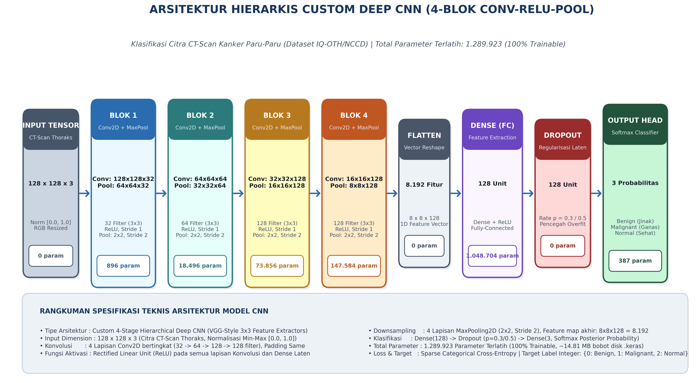

# TUGAS UJIAN TENGAH SEMESTER (UTS) — DEEP LEARNING (KELAS A)
## Eksperimen Optimasi Bertingkat (Progressive Ablation Study): Arsitektur Convolutional Neural Network (CNN) pada Citra CT-Scan Thoraks Kanker Paru-Paru (IQ-OTH/NCCD)

[](https://www.tensorflow.org/)
[](https://www.python.org/)
[](https://creativecommons.org/licenses/by/4.0/)
[](https://doi.org/10.17632/bhmdr45bh2.2)
[](https://colab.research.google.com/github/attaramadhani/TUGAS-UTS_DEEP-LEARNING-A/blob/main/Tugas_UTS_CNN_IQOTHNCCD.ipynb)
[](https://drive.google.com/drive/folders/14D2ot8mEhchPf_0IbVNq14XTHpiXu36m?usp=sharing)

---

### 👥 Identitas Anggota Kelompok 6:
| No. | Nama Lengkap | NIM | Kelas | Program Studi |
| :---: | :--- | :---: | :---: | :---: |
| 1. | **Attala Alif Ramadhani Tri Hida** | `230441100144` (23-144) | Deep Learning (A) | Sistem Informasi |
| 2. | **Naufal Husain** | `240441100038` (24-038) | Deep Learning (A) | Sistem Informasi |
| 3. | **M.Rafly Kurniawan** | `240441100086` (24-086) | Deep Learning (A) | Sistem Informasi |
| 4. | **Nafaul Hernanda Romadlona** | `240441100125` (24-125) | Deep Learning (A) | Sistem Informasi |

* **Dosen Pengampu:** Dr. Wahyudi Setiawan, S.Kom., M.Kom.  
* **Program Studi:** S1 Sistem Informasi, Fakultas Teknik, Universitas Trunojoyo Madura  
* **Penyimpanan Hasil (Google Drive):** [📁 Akses Folder Hasil Eksperimen & Laporan Word UTS](https://drive.google.com/drive/folders/14D2ot8mEhchPf_0IbVNq14XTHpiXu36m?usp=sharing)

---

## 📌 Ringkasan Proyek
Repository ini berisi implementasi lengkap tugas Ujian Tengah Semester (UTS) mata kuliah Deep Learning untuk mengklasifikasikan citra CT-Scan rongga dada (kanker paru-paru) ke dalam 3 kelas:
1. **Benign cases** (Tumor Jinak)
2. **Malignant cases** (Kanker Ganas)
3. **Normal cases** (Jaringan Sehat)

Eksperimen dirancang dengan paradigma **Optimasi Bertingkat (Progressive Ablation Study)**: 1 arsitektur dasar CNN yang sama dievaluasi melalui 4 skenario optimasi berantai. Konfigurasi terbaik dari tiap skenario diwariskan sebagai fondasi pengujian pada skenario berikutnya hingga terpilih model akhir (**Final Champion Model**).

> [!NOTE]
> **📂 Akses Publik Berkas Hasil Eksperimen di Google Drive:**  
> Seluruh artefak hasil eksperimen lengkap (berkas bobot model `final_champion_model.keras`, gambar grafik evaluasi 300 DPI di `figures/`, log metrik di `logs/`, `cache.pkl`, dan dokumen Microsoft Word resmi `Laporan_Lengkap_UTS_DeepLearning_CNN.docx`) dapat diakses dan diunduh langsung melalui tautan Google Drive resmi berikut:  
> 🔗 **[Google Drive — Folder Hasil Eksperimen UTS Deep Learning](https://drive.google.com/drive/folders/14D2ot8mEhchPf_0IbVNq14XTHpiXu36m?usp=sharing)**

---

## 🗂️ Informasi Dataset Sumber Terpercaya
* **Sumber Data:** [Mendeley Data — The IQ-OTHNCCD Lung Cancer Dataset](https://doi.org/10.17632/bhmdr45bh2.2)
* **Penulis Dataset:** Hamdalla Alyasriy & Muayed AL-Huseiny (Wasit University & IQ-OTH/NCCD Oncology Centers, Irak)
* **DOI:** `10.17632/bhmdr45bh2.2` (Lisensi CC BY 4.0)
* **Total Citra:** **1.097 citra** format DICOM/PNG/JPEG beresolusi asli 512×512 piksel:
  - **Benign:** 120 citra (10.94%)
  - **Malignant:** 561 citra (51.14%)
  - **Normal:** 416 citra (37.92%)

---

### 🧱 Arsitektur Model CNN (Custom 4-Block)
Model yang digunakan adalah arsitektur *Deep Convolutional Neural Network* modular 4 blok (Total Parameter: **1.289.923 Parameter Terlatih**, 100% Trainable, ukuran file bobot `final_champion_model.keras` sebesar **~14.81 MB**):
- **Input Layer:** `(128, 128, 3)` ternormalisasi $[0.0, 1.0]$.
- **Blok Konvolusi 1:** `Conv2D(32, kernel 3x3, padding='same', activation='relu')` $\rightarrow$ `MaxPooling2D(2x2)` $\rightarrow$ Output `(64, 64, 32)` [896 param]
- **Blok Konvolusi 2:** `Conv2D(64, kernel 3x3, padding='same', activation='relu')` $\rightarrow$ `MaxPooling2D(2x2)` $\rightarrow$ Output `(32, 32, 64)` [18.496 param]
- **Blok Konvolusi 3:** `Conv2D(128, kernel 3x3, padding='same', activation='relu')` $\rightarrow$ `MaxPooling2D(2x2)` $\rightarrow$ Output `(16, 16, 128)` [73.856 param]
- **Blok Konvolusi 4:** `Conv2D(128, kernel 3x3, padding='same', activation='relu')` $\rightarrow$ `MaxPooling2D(2x2)` $\rightarrow$ Output `(8, 8, 128)` [147.584 param]
- **Dense Classifier:** `Flatten()` $\rightarrow$ `Dense(128, activation='relu')` $\rightarrow$ `Dropout(rate=p)` $\rightarrow$ `Dense(3, activation='softmax')` [1.049.091 param]

<p align="center">
  
  <br/>
  <em><b>Gambar:</b> Diagram Alur Arsitektur Kustom Deep CNN 4-Blok Hierarkis (Input Citra CT-Scan 128×128×3 hingga Output Softmax 3-Kelas, Total 1.289.923 Parameter)</em>
</p>

---

## 🔬 Metodologi & Hasil Eksperimen 4 Skenario Bertingkat

```
[Skenario 1: Variasi Data Split] ──> Pilih Split 90:05:05 (Akurasi 98.18%)
                 │
                 ▼
[Skenario 2: Uji Augmentasi Data] ──> Pilih Tanpa Augmentasi (Akurasi 98.18%)
                 │
                 ▼
[Skenario 3: Komparasi Optimizer] ──> Pilih Adam (Akurasi 98.18%)
                 │
                 ▼
[Skenario 4: Studi Dropout]       ──> Pilih Dropout 0.3 / 0.5 (Akurasi 98.18%, ROC-AUC 99.95%)
                 │
                 ▼
      [FINAL CHAMPION MODEL]
```

### Rekapitulasi Metrik Evaluasi:
| Skenario | Varian yang Diuji | Akurasi Uji | Loss Uji | Macro Precision | Macro Recall | Macro F1-Score | Status |
| :--- | :--- | :---: | :---: | :---: | :---: | :---: | :---: |
| **Skenario 1** | Split 70:15:15 | 92.73% | 0.1494 | 94.57% | 84.92% | 88.00% | - |
| **Skenario 1** | Split 80:10:10 | 89.09% | 0.2782 | 92.06% | 79.37% | 82.76% | - |
| **Skenario 1** | **Split 90:05:05** | **98.18%** | **0.0500** | **95.24%** | **98.41%** | **96.62%** | **Juara S1** 🏆 |
| **Skenario 2** | **Tanpa Augmentasi** | **98.18%** | **0.0500** | **95.24%** | **98.41%** | **96.62%** | **Juara S2** 🏆 |
| **Skenario 2** | Dengan Augmentasi | 67.27% | 0.6853 | 45.33% | 51.19% | 47.43% | - |
| **Skenario 3** | **Adam (lr=0.0005)** | **98.18%** | **0.0500** | **95.24%** | **98.41%** | **96.62%** | **Juara S3** 🏆 |
| **Skenario 3** | RMSprop (lr=0.0005) | 90.91% | 0.2381 | 93.59% | 89.68% | 90.86% | - |
| **Skenario 3** | SGD Momentum (lr=0.001)| 65.45% | 0.7920 | 44.95% | 46.83% | 44.17% | - |
| **Skenario 4** | Dropout 0.0 | 98.18% | 0.0815 | 95.24% | 98.41% | 96.62% | - |
| **Skenario 4** | **Dropout 0.3** | **98.18%** | **0.0500** | **95.24%** | **98.41%** | **96.62%** | **CHAMPION (Loss 0.0500 Terendah)** 🌟 |
| **Skenario 4** | **Dropout 0.5** | **98.18%** | **0.0759** | **98.85%** | **98.41%** | **98.60%** | **CHAMPION (Macro F1 & AUC 99.95%)** 🌟 |

---

## 📁 Struktur File Repositori (Hanya File Penting)

```text
TUGAS-UTS_DEEP-LEARNING-A/
│
├── .gitignore                                  # Mengabaikan dataset lokal, cache, model, & file laporan
├── README.md                                   # Dokumentasi lengkap & ringkasan hasil
├── main.py                                     # Program Utama Eksekusi Lokal (Pipeline Terpadu 4 Skenario)
├── Tugas_UTS_CNN_IQOTHNCCD.ipynb               # Jupyter Notebook Siap Eksekusi di Google Colab
└── outputs/figures/cnn_architecture.png        # Diagram visual arsitektur CNN resolusi tinggi 300 DPI
```

> **📌 Catatan Berkas Tambahan:**  
> Berkas dokumen resmi Microsoft Word (`Laporan_Lengkap_UTS_DeepLearning_CNN.docx`), bobot model biner (`outputs/models/`), grafik resolusi tinggi (`outputs/figures/`), dan log CSV (`outputs/logs/`) disimpan secara lokal dan dapat diakses publik melalui:  
> 🔗 **[Folder Google Drive Hasil Eksperimen & Dokumen Laporan UTS](https://drive.google.com/drive/folders/14D2ot8mEhchPf_0IbVNq14XTHpiXu36m?usp=sharing)**

---

## 🚀 Panduan Menjalankan Kode Program

### A. Menjalankan di Google Colab (Uji Coba Langsung)
1. Klik tombol badge berikut untuk membuka notebook langsung di Google Colab:
   [](https://colab.research.google.com/github/attaramadhani/TUGAS-UTS_DEEP-LEARNING-A/blob/main/Tugas_UTS_CNN_IQOTHNCCD.ipynb)
2. Pastikan Runtime menggunakan GPU (Menu: *Runtime* -> *Change runtime type* -> *T4 GPU*).
3. Di **Langkah 1**:
   - Jika Anda memiliki folder tujuan khusus di Google Drive (misalnya nama folder dari link sharing Drive Anda), Anda dapat mengisi variabel `TARGET_FOLDER_NAME = "NAMA_FOLDER_ANDA"`. Secara default folder akan bernama `TUGAS_UTS_DEEP_LEARNING_A` (sesuai folder publik: [Google Drive Hasil Eksperimen](https://drive.google.com/drive/folders/14D2ot8mEhchPf_0IbVNq14XTHpiXu36m?usp=sharing)).
   - Setujui *prompt* otorisasi akun saat Google Drive di-mount.
4. Klik *Runtime* -> *Run all* (Jalankan semua sel):
   - Proses pelatihan 4 skenario bertingkat akan berjalan langsung di GPU Colab.
   - Setiap kali grafik visualisasi digambar, file gambar langsung diekspor real-time ke folder Google Drive Anda.
   - Pada **Langkah 17**, file `cache.pkl` otomatis dikompilasi dari hasil pelatihan aktual dan disimpan ke Google Drive.
   - Pada **Langkah 18**, laporan lengkap `Laporan_Lengkap_UTS_DeepLearning_CNN.docx` otomatis dibuat dan disimpan ke Google Drive.
   - Pada **Langkah 19**, sistem akan memverifikasi dan menampilkan seluruh daftar berkas yang telah tersimpan rapi di Google Drive.

### B. Menjalankan Secara Lokal via Terminal (`main.py`)
```bash
# 1. Klon Repositori
git clone https://github.com/attaramadhani/TUGAS-UTS_DEEP-LEARNING-A.git
cd TUGAS-UTS_DEEP-LEARNING-A

# 2. Instal Pustaka Pendukung
pip install tensorflow numpy pandas scikit-learn matplotlib seaborn pillow kagglehub python-docx

# 3. Eksekusi Program Utama (Menjalankan seluruh alur bertingkat + Word Report)
python main.py

# Opsi lain:
# Hanya unduh dataset:
python main.py --download-only

# Hanya buat ulang file laporan Word dari log:
python main.py --report-only
```

---

## 📚 Referensi Dataset
Alyasriy, H., & AL-Huseiny, M. (2020). *The IQ-OTHNCCD Lung Cancer Dataset*. Mendeley Data, V2, doi: [10.17632/bhmdr45bh2.2](https://doi.org/10.17632/bhmdr45bh2.2).
