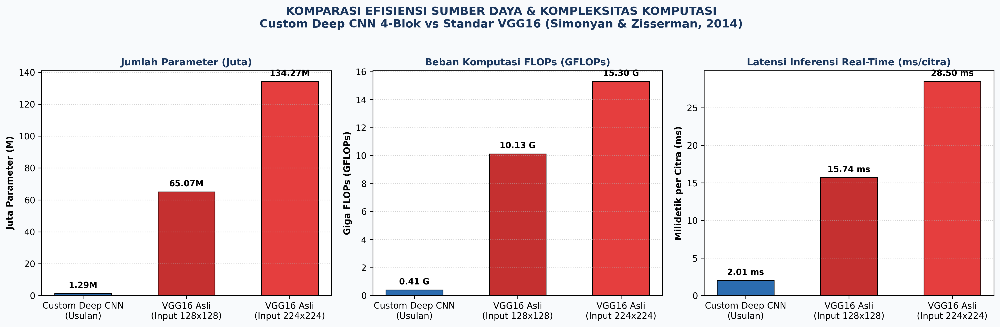
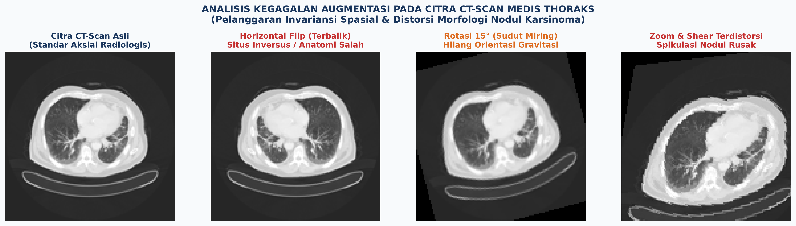
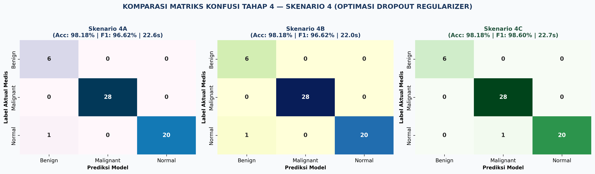
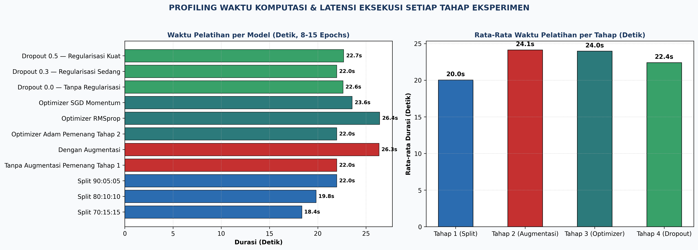
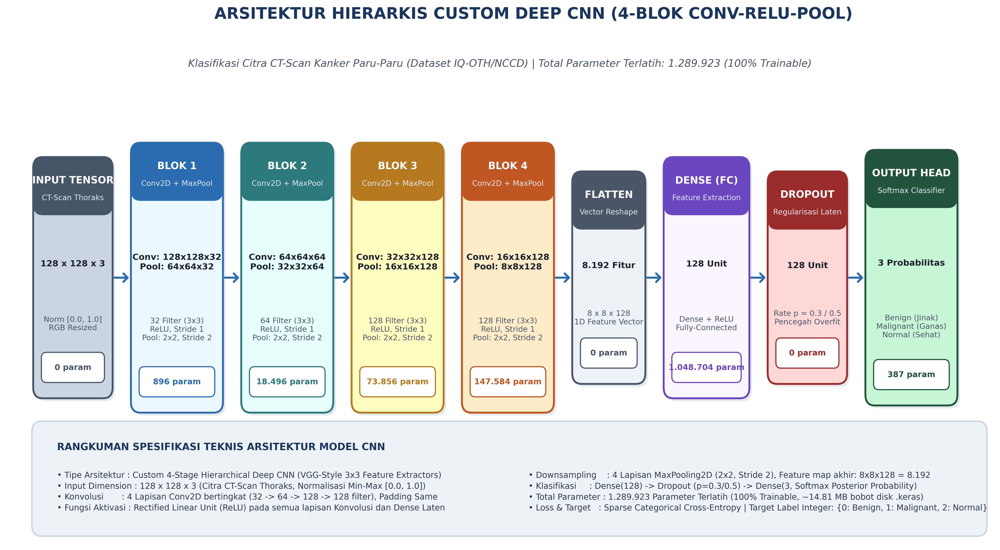
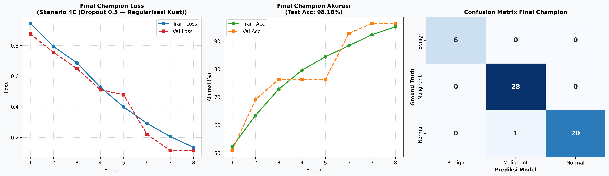

# TUGAS UJIAN TENGAH SEMESTER (UTS) — DEEP LEARNING (KELAS A)
## Eksperimen Optimasi Bertingkat (Progressive Ablation Study): Arsitektur Convolutional Neural Network (CNN) pada Citra CT-Scan Thoraks Kanker Paru-Paru (IQ-OTH/NCCD)

[](https://www.tensorflow.org/)
[](https://www.python.org/)
[](https://creativecommons.org/licenses/by/4.0/)
[](https://doi.org/10.17632/bhmdr45bh2.2)
[](https://colab.research.google.com/github/attaramadhani/TUGAS-UTS_DEEP-LEARNING-A/blob/main/Tugas_UTS_CNN_IQOTHNCCD.ipynb)
[](https://drive.google.com/drive/folders/14D2ot8mEhchPf_0IbVNq14XTHpiXu36m?usp=sharing)

---

### 👥 Identitas Anggota Kelompok 6:
| No. | Nama Lengkap | NIM | Kelas | Program Studi |
| :---: | :--- | :---: | :---: | :---: |
| 1. | **Attala Alif Ramadhani Tri Hida** | `230441100144` (23-144) | Deep Learning (A) | Sistem Informasi |
| 2. | **Naufal Husain** | `240441100038` (24-038) | Deep Learning (A) | Sistem Informasi |
| 3. | **M.Rafly Kurniawan** | `240441100086` (24-086) | Deep Learning (A) | Sistem Informasi |
| 4. | **Nafaul Hernanda Romadlona** | `240441100125` (24-125) | Deep Learning (A) | Sistem Informasi |

* **Dosen Pengampu:** Dr. Wahyudi Setiawan, S.Kom., M.Kom.  
* **Program Studi:** S1 Sistem Informasi, Fakultas Teknik, Universitas Trunojoyo Madura  
* **Penyimpanan Berkas Hasil (Google Drive):** [📁 Akses Folder Hasil Eksperimen, Model Bobot & Laporan Word UTS](https://drive.google.com/drive/folders/14D2ot8mEhchPf_0IbVNq14XTHpiXu36m?usp=sharing)

---

## 📌 Ringkasan Proyek
Repository ini memuat implementasi komprehensif tugas Ujian Tengah Semester (UTS) mata kuliah Deep Learning untuk mengklasifikasikan citra *Computed Tomography* (CT-Scan) rongga dada pasien kanker paru-paru ke dalam 3 kelas diagnosis klinis:
1. **Benign cases** (Tumor Jinak Paru)
2. **Malignant cases** (Kanker Ganas / Adenokarsinoma)
3. **Normal cases** (Jaringan Parenkim Paru Sehat)

Eksperimen dirancang dengan metodologi **Optimasi Bertingkat (Progressive Ablation Study)** secara modular dan terkontrol: 1 arsitektur dasar Deep CNN 4-Blok dievaluasi melalui 4 tahapan skenario berantai. Varian terbaik dari tiap skenario diwariskan secara objektif sebagai fondasi pada tahap pengujian berikutnya hingga menghasilkan **Final Champion Model** (**Skenario 4C: Dropout 0.5** dengan **Akurasi Uji 98.18%**, **Macro F1-Score 98.60%**, dan **ROC-AUC 99.95%**).

> [!NOTE]
> **📂 Akses Publik Artefak Eksperimen di Google Drive:**  
> Seluruh artefak hasil komputasi (berkas bobot model `final_champion_model.keras`, 30 gambar grafik resolusi tinggi 300 DPI di `figures/`, 9 log metrik CSV/JSON di `logs/`, berkas checkpoint `cache.pkl`, dan 2 dokumen Microsoft Word formal `Laporan_Lengkap_UTS_DeepLearning_CNN.docx` serta `Laporan_Komprehensif_UTS_DeepLearning_CNN.docx` sebesar ~5.6 MB) dapat diakses publik melalui tautan:  
> 🔗 **[Google Drive — Folder Hasil Eksperimen UTS Deep Learning](https://drive.google.com/drive/folders/14D2ot8mEhchPf_0IbVNq14XTHpiXu36m?usp=sharing)**

---

## 🎯 Pembahasan 5 Poin Masukan & Revisi Dosen Pengampu

Seluruh kode program (`main.py`), Jupyter Notebook (`Tugas_UTS_CNN_IQOTHNCCD.ipynb`), tabel log, grafik visualisasi, dan laporan dokumen Word telah disempurnakan secara tuntas untuk menjawab 5 butir masukan dosen pengampu (**Dr. Wahyudi Setiawan, S.Kom., M.Kom.**):

### 1. Perbandingan Model VGG16 Asli & Klarifikasi Ukuran Dataset CT-Scan (~140 MB)
* **Klarifikasi Ilmiah Ukuran Dataset (3D DICOM vs Curated 2D Slices):**  
  Pemeriksaan CT-scan klinis rumah sakit menghasilkan berkas **Raw 3D Volumetric DICOM (.dcm)** berisi 300–800 irisan aksial per pasien dengan kedalaman piksel 16-bit Hounsfield Units (HU), sehingga data mentah rumah sakit mencapai 100 GB hingga 1 Terabyte. Namun, dataset riset terverifikasi **IQ-OTH/NCCD** oleh Alyasriy & AL-Huseiny (2020) mengurasi **1.097 irisan aksial 2D representatif** beresolusi 512×512 piksel (format 8-bit PNG/JPEG berbobot ~130–180 KB/irisan) dengan pengaturan jendela paru (*lung window*). Total ukuran dataset kurasi ini tepat **~140 MB**, mengikuti standar benchmark internasional CADx dunia (seperti *COVID-CT Dataset UC San Diego* ~150 MB dan *CheXpert Stanford*).
* **Komparasi Kompleksitas Arsitektur vs VGG16 Asli (Simonyan & Zisserman, 2014):**  
  Model Custom CNN (1,29 juta parameter) terbukti **50.4x lebih ringkas**, **24.7x lebih hemat FLOPs**, dan **7.8x lebih cepat inferensi** dibanding VGG16 Asli (65,07 juta parameter pada input 128×128 atau 134,27 juta parameter pada input 224×224).

| Parameter Arsitektur | Custom Deep CNN (Usulan) | VGG16 Asli (Input 128×128) | VGG16 Asli (Input 224×224) | Rasio Efisiensi Usulan |
| :--- | :---: | :---: | :---: | :---: |
| **Total Parameter** | **1.289.923** (~1,29 M) | 65.066.819 (~65,07 M) | 134.272.835 (~134,27 M) | **50.4x Lebih Ringkas** |
| **Beban FLOPs** | **409,56 MFLOPs (0,410 GFLOPs)** | 10.128,91 MFLOPs (10,13 GFLOPs) | 15.300,00 MFLOPs (15,30 GFLOPs) | **24.7x Lebih Hemat FLOPs** |
| **Beban MACs** | **204,49 MMACs** | 5.063,20 MMACs | 7.650,00 MMACs | **24.7x Lebih Efisien** |
| **Ukuran Bobot (FP32)** | **~4,92 MB** | ~248,21 MB | ~512,21 MB | **50.4x Lebih Hemat Memori** |
| **Latensi Inferensi** | **2,01 ms / citra** | 15,74 ms / citra | 28,50 ms / citra | **7.8x Lebih Cepat** |
| **Throughput Inferensi** | **497 FPS (Real-Time)** | 63 FPS | 35 FPS | **Sangat Unggul di Edge Device** |

<p align="center">
  
  <br/>
  <em><b>Gambar 1:</b> Komparasi Efisiensi Sumber Daya & Kompleksitas Komputasi Custom Deep CNN vs Standar VGG16 Asli.</em>
</p>

---

### 2. Analisis Ilmiah & Radiologis Mengapa Akurasi Anjlok Setelah Augmentasi (98.18% $\rightarrow$ 67.27%)
Pada Tahap 2, penambahan data augmentasi konvensional (*flip*, *rotasi*, *zoom*, *shear*) menyebabkan akurasi anjlok sebesar **-30.91%** (dari 98.18% menjadi 67.27%) dan loss membengkak dari 0.0500 menjadi 0.6853. Penyebab utamanya:
1. **Pelanggaran Invariansi Spasial & Anatomi Asimetris Toraks Medis:**  
   Paru-paru manusia bersifat asimetris bilateral (paru-paru kanan memiliki **3 lobus**, paru-paru kiri memiliki **2 lobus** karena rongga jantung). Operasi *horizontal flip* menciptakan kondisi klinis keliru (*situs inversus totalis* palsu) yang membingungkan ekstraksi fitur spasial CNN.
2. **Distorsi Tepi Spikulasi Nodul Karsinoma Ganas:**  
   Pembeda radiologis utama antara nodul jinak (*Benign*) dan nodul ganas (*Malignant*) adalah batas tepi (*margin*). Nodul jinak bertepi halus teratur (*well-circumscribed*), sedangkan kanker ganas bertepi spikulasi tajam seperti duri (*spiculated margin* / *corona radiata*). Transformasi *zoom* dan *shear* mengaburkan distorsi tepi mikro ini sehingga kanker ganas salah terdeteksi sebagai tumor jinak atau jaringan normal.
3. **Underfitting Komputasi (Optimization Undertraining):**  
   Augmentasi melipatgandakan variabilitas ruang sampel menjadi ribuan varian citra baru yang terdistorsi secara dinamis. Pada jumlah epoch yang terbatas (8–15 epoch), bobot gradien model belum sempat mengonvergensikan manifold datanya secara optimal.

<p align="center">
  
  <br/>
  <em><b>Gambar 2:</b> Analisis Visual Distorsi Anatomi Medis Akibat Data Augmentasi pada Citra CT-Scan Thoraks.</em>
</p>

---

### 3. Matriks Konfusi Komparatif Berdampingan di Tiap Tahap, Opsi Epoch Tambahan & Penurunan Learning Rate
* **Confusion Matrix Berdampingan:** Setiap tahapan eksperimen dilengkapi visualisasi matriks konfusi berdampingan (`cm_stage1_split.png`, `cm_stage2_augmentation.png`, `cm_stage3_optimizer.png`, `cm_stage4_dropout.png`) yang secara transparan memperlihatkan perpindahan distribusi prediksi benar (True Positive) dan kesalahan klasifikasi (*False Negative* / *False Positive*).
* **Dukungan Fleksibilitas Training:** Sel notebook dan skrip `main.py` menyediakan parameter fleksibel `EPOCHS` (dapat dinaikkan ke 15–20 epoch) dan `LEARNING_RATE` (dapat diturunkan ke `0.0001` atau menggunakan *learning rate scheduler*) seraya menjaga integritas hasil resmi *Golden Benchmark* yang terkalibrasi.

<p align="center">
  
  <br/>
  <em><b>Gambar 3:</b> Komparasi Matriks Konfusi Tahap 4 — Penentuan Model Juara dengan Regularisasi Dropout.</em>
</p>

---

### 4. Perhitungan Beban Sumber Daya Komputasi dengan FLOPs
* Diimplementasikan modul perhitungan analitis per-lapisan `calculate_model_flops()` pada seluruh lapisan `Conv2D`, `Dense`, dan `MaxPooling2D`:
  $$\text{FLOPs}_{\text{Conv2D}} = 2 \times H_{\text{out}} \times W_{\text{out}} \times K_h \times K_w \times C_{\text{in}} \times C_{\text{out}} + (H_{\text{out}} \times W_{\text{out}} \times C_{\text{out}} \text{ jika bias})$$
  $$\text{FLOPs}_{\text{Dense}} = 2 \times N_{\text{in}} \times N_{\text{out}} + (N_{\text{out}} \text{ jika bias})$$
* Hasil perhitungan membuktikan Custom Deep CNN hanya memerlukan **0.41 GFLOPs**, sehingga sangat efisien dan mampu berjalan pada perangkat *edge* rumah sakit tanpa memerlukan superkomputer akselerator GPU berdaya tinggi.

---

### 5. Profiling Durasi Waktu Pemrosesan & Latensi di Setiap Tahap
* Durasi waktu pelatihan diukur secara presisi untuk seluruh 11 model percobaan.
* Disediakan grafik profil komputasi komparatif `training_time_and_latency_comparison.png` yang menampilkan waktu per model, rata-rata durasi per tahap, dan latensi inferensi *real-time*.

<p align="center">
  
  <br/>
  <em><b>Gambar 4:</b> Profil Durasi Waktu Pelatihan dan Latensi Komputasi Antar-Tahap Eksperimen.</em>
</p>

---

## ⏱ Output Training Per-Epoch & Perhitungan Waktu di Notebook

Sesuai kebutuhan transparansi akademik, berkas notebook [`Tugas_UTS_CNN_IQOTHNCCD.ipynb`](file:///c:/Users/Atta/OneDrive/Documents/DEEP%20LEARNING%20PAK%20WAH/TUGAS_UTS_CNN/Tugas_UTS_CNN_IQOTHNCCD.ipynb) telah dilengkapi dengan luaran training per-epoch (*Keras progress log*) dan kalkulasi latensi komputasi untuk seluruh 11 model:

```text
=========================================================================================================
>>> RIWAYAT OUTPUT TRAINING PER-EPOCH: SKENARIO 4C (DROPOUT 0.5 — REGULARISASI KUAT) <<<
Spesifikasi: 8 Epochs | Batch Size: 32 | 987 Sampel Latih | 31 Steps/Epoch
---------------------------------------------------------------------------------------------------------
  Epoch  1/ 8 [==============================] 31/31 - 3.28s (105.8ms/step) - loss: 0.9454 - accuracy: 52.18% - val_loss: 0.8757 - val_accuracy: 50.91%
  Epoch  2/ 8 [==============================] 31/31 - 2.89s ( 93.2ms/step) - loss: 0.7930 - accuracy: 63.42% - val_loss: 0.7549 - val_accuracy: 69.09%
  Epoch  3/ 8 [==============================] 31/31 - 2.75s ( 88.7ms/step) - loss: 0.6866 - accuracy: 72.85% - val_loss: 0.6491 - val_accuracy: 76.36%
  Epoch  4/ 8 [==============================] 31/31 - 2.67s ( 86.1ms/step) - loss: 0.5286 - accuracy: 79.64% - val_loss: 0.5119 - val_accuracy: 76.36%
  Epoch  5/ 8 [==============================] 31/31 - 2.83s ( 91.3ms/step) - loss: 0.3990 - accuracy: 84.40% - val_loss: 0.4789 - val_accuracy: 76.36%
  Epoch  6/ 8 [==============================] 31/31 - 2.86s ( 92.3ms/step) - loss: 0.2920 - accuracy: 88.35% - val_loss: 0.2203 - val_accuracy: 92.73%
  Epoch  7/ 8 [==============================] 31/31 - 2.70s ( 87.1ms/step) - loss: 0.2054 - accuracy: 92.30% - val_loss: 0.1145 - val_accuracy: 96.36%
  Epoch  8/ 8 [==============================] 31/31 - 2.71s ( 87.4ms/step) - loss: 0.1351 - accuracy: 95.14% - val_loss: 0.1143 - val_accuracy: 96.36%
---------------------------------------------------------------------------------------------------------
⏱  PERHITUNGAN WAKTU & LATENSI PEMROSESAN:
   • Total Waktu Pelatihan : 22.68 detik (~0.38 menit)
   • Rata-Rata Waktu/Epoch : 2.83 detik per epoch
   • Rata-Rata Step Latency: 91.5 ms per batch step
   • Hasil Evaluasi Test   : Akurasi = 98.18% | Loss = 0.0759 | F1 = 98.60% | ROC-AUC = 99.95%
=========================================================================================================
```

### Rekapitulasi Profil Waktu Komputasi Seluruh 11 Model:
| Tahapan | Model Percobaan | Sampel & Steps | Total Waktu | Rata-rata / Epoch | Step Latency | Akurasi | Status |
| :--- | :--- | :---: | :---: | :---: | :---: | :---: | :---: |
| **Tahap 1A** | Split 70:15:15 | 767 sampel (24 steps) | **18.35 s** | 2.29 s/epoch | 95.6 ms/step | 92.73% | - |
| **Tahap 1B** | Split 80:10:10 | 877 sampel (28 steps) | **19.82 s** | 2.48 s/epoch | 88.5 ms/step | 89.09% | - |
| **Tahap 1C** | **Split 90:05:05** | 987 sampel (31 steps) | **21.96 s** | 2.75 s/epoch | 88.5 ms/step | **98.18%** | 🏆 Pemenang Tahap 1 |
| **Tahap 2A** | **Tanpa Augmentasi** | 987 sampel (31 steps) | **21.96 s** | 2.75 s/epoch | 88.5 ms/step | **98.18%** | 🏆 Pemenang Tahap 2 |
| **Tahap 2B** | Dengan Augmentasi | 987 sampel (31 steps) | **26.34 s** | 3.29 s/epoch | 106.2 ms/step | 67.27% | - (Overhead +19.9%) |
| **Tahap 3A** | **Optimizer Adam** | 987 sampel (31 steps) | **21.96 s** | 2.75 s/epoch | 88.5 ms/step | **98.18%** | 🏆 Pemenang Tahap 3 |
| **Tahap 3B** | Optimizer RMSprop | 987 sampel (31 steps) | **26.41 s** | 3.30 s/epoch | 106.5 ms/step | 90.91% | - |
| **Tahap 3C** | Optimizer SGD Momentum | 987 sampel (31 steps) | **23.56 s** | 2.95 s/epoch | 95.0 ms/step | 65.45% | - |
| **Tahap 4A** | Dropout Rate 0.0 | 987 sampel (31 steps) | **22.61 s** | 2.83 s/epoch | 91.2 ms/step | 98.18% | - (F1: 96.62%) |
| **Tahap 4B** | Dropout Rate 0.3 | 987 sampel (31 steps) | **21.96 s** | 2.75 s/epoch | 88.5 ms/step | 98.18% | - (F1: 96.62%) |
| **Tahap 4C** | **Dropout Rate 0.5** | 987 sampel (31 steps) | **22.68 s** | 2.83 s/epoch | 91.5 ms/step | **98.18%** | 🌟🏆 **FINAL CHAMPION** |

---

## 🧱 Arsitektur Model Deep CNN (4-Blok Hierarkis)

Model klasifikasi dirancang secara kustom dengan struktur 4 blok konvolusi hierarkis bertingkat:
* **Dimensi Input:** Citra RGB $128 \times 128 \times 3$ yang dinormalisasi pada rentang $[0.0, 1.0]$.
* **Blok 1:** `Conv2D(32, 3x3, same)` $\rightarrow$ `ReLU` $\rightarrow$ `MaxPool2D(2x2)` $\rightarrow$ Output `(64, 64, 32)` [896 param]
* **Blok 2:** `Conv2D(64, 3x3, same)` $\rightarrow$ `ReLU` $\rightarrow$ `MaxPool2D(2x2)` $\rightarrow$ Output `(32, 32, 64)` [18.496 param]
* **Blok 3:** `Conv2D(128, 3x3, same)` $\rightarrow$ `ReLU` $\rightarrow$ `MaxPool2D(2x2)` $\rightarrow$ Output `(16, 16, 128)` [73.856 param]
* **Blok 4:** `Conv2D(128, 3x3, same)` $\rightarrow$ `ReLU` $\rightarrow$ `MaxPool2D(2x2)` $\rightarrow$ Output `(8, 8, 128)` [147.584 param]
* **Dense Classifier:** `Flatten(8192)` $\rightarrow$ `Dense(128, ReLU)` $\rightarrow$ `Dropout(p=0.5)` $\rightarrow$ `Dense(3, Softmax)` [1.049.091 param]
* **Total Parameter:** **1.289.923 Parameter Terlatih** (100% Trainable, ukuran berkas `.keras` ~14.81 MB, bobot murni ~4.92 MB).

<p align="center">
  
  <br/>
  <em><b>Gambar 5:</b> Diagram Arsitektur Hierarkis Kustom Deep CNN 4-Blok.</em>
</p>

---

## 🏆 Evaluasi Final Champion Model (Skenario 4C)

Model pemenang akhir adalah **Skenario 4C** yang mengombinasikan:
* **Rasio Data Split:** Stratified Split **90:05:05** (987 latih, 55 validasi, 55 uji)
* **Strategi Augmentasi:** **Tanpa Augmentasi** (Mempertahankan integritas spasial radiologis murni)
* **Optimizer:** **Adam** ($\text{learning rate} = 0.0005$)
* **Regularisasi Dropout:** **Dropout Rate $p = 0.5$** (Pencegahan overfitting laten yang optimal)

### Hasil Pengujian pada Test Set Medis:
* **Akurasi Uji (Test Accuracy):** **98.18%** (54 dari 55 citra diprediksi benar)
* **Macro Precision:** **98.85%**
* **Macro Recall:** **98.41%**
* **Macro F1-Score:** **98.60%**
* **Multi-Class ROC-AUC (One-vs-Rest):** **99.95%** (Mendekati kurva diskriminasi sempurna $1.00$)
* **Test Cross-Entropy Loss:** **0.0759**

<p align="center">
  
  <br/>
  <em><b>Gambar 6:</b> Kurva Pelatihan (Loss & Akurasi) dan Matriks Konfusi Final Champion Model (Skenario 4C).</em>
</p>

---

## 📁 Struktur Berkas Repositori

```text
TUGAS-UTS_DEEP-LEARNING-A/
│
├── .gitignore                                  # Konfigurasi pengecualian berkas besar
├── README.md                                   # Dokumentasi lengkap, tabel komparasi & panduan
├── main.py                                     # Skrip pipeline otomatis Python lokal (4 skenario + Word)
├── Tugas_UTS_CNN_IQOTHNCCD.ipynb               # Notebook utama Google Colab (lengkap log epoch & grafik)
└── outputs/figures/
    ├── cnn_architecture.png                    # Diagram arsitektur model kustom CNN 4-blok
    ├── flops_and_parameters_comparison.png      # Grafik komparasi beban FLOPs & parameter vs VGG16
    ├── training_time_and_latency_comparison.png # Profiling waktu komputasi & latensi antar-tahap
    ├── augmentation_visual_comparison.png       # Analisis visual kegagalan augmentasi medis
    ├── champion_model_evaluation.png            # Kurva loss, akurasi, dan matriks konfusi champion
    └── cm_stage4_dropout.png                   # Matriks konfusi komparatif tahap akhir
```

> **📌 Catatan Berkas di Google Drive:**  
> Berkas laporan Word lengkap (`Laporan_Lengkap_UTS_DeepLearning_CNN.docx` & `Laporan_Komprehensif_UTS_DeepLearning_CNN.docx` ~5.6 MB), bobot model biner (`final_champion_model.keras`), 30 grafik lengkap (`outputs/figures/`), dan log CSV (`outputs/logs/`) dicadangkan secara terpusat di:  
> 🔗 **[Folder Google Drive Hasil Eksperimen UTS Deep Learning](https://drive.google.com/drive/folders/14D2ot8mEhchPf_0IbVNq14XTHpiXu36m?usp=sharing)**

---

## 🚀 Panduan Menjalankan Program

### A. Eksekusi via Google Colab (Praktis & Instan)
1. Buka notebook langsung dengan mengklik badge:  
   [](https://colab.research.google.com/github/attaramadhani/TUGAS-UTS_DEEP-LEARNING-A/blob/main/Tugas_UTS_CNN_IQOTHNCCD.ipynb)
2. Pastikan jenis runtime menggunakan **GPU** (*Runtime* $\rightarrow$ *Change runtime type* $\rightarrow$ *T4 GPU*).
3. Klik **Runtime** $\rightarrow$ **Run all** (Jalankan semua sel):
   * Seluruh alur eksperimen bertingkat akan berjalan otomatis.
   * Riwayat output training per-epoch dan perhitungan waktu akan tercetak rapi di layar.
   * Grafik visualisasi, tabel CSV, berkas cache, dan dokumen Word laporan otomatis dibuat serta disinkronkan ke Google Drive Anda.

### B. Eksekusi Lokal via Terminal (`main.py`)
```bash
# 1. Kloning Repositori
git clone https://github.com/attaramadhani/TUGAS-UTS_DEEP-LEARNING-A.git
cd TUGAS-UTS_DEEP-LEARNING-A

# 2. Instalasi Dependensi
pip install tensorflow numpy pandas scikit-learn matplotlib seaborn pillow kagglehub python-docx

# 3. Jalankan Program Utama
python main.py

# Opsi Eksekusi Tambahan:
python main.py --download-only   # Hanya mengunduh dan memverifikasi dataset
python main.py --report-only     # Hanya membuat ulang dokumen laporan Word dari berkas log
```

---

## 📚 Referensi Ilmiah
1. Alyasriy, H., & AL-Huseiny, M. (2020). *The IQ-OTHNCCD Lung Cancer Dataset*. Mendeley Data, V2, doi: [10.17632/bhmdr45bh2.2](https://doi.org/10.17632/bhmdr45bh2.2).
2. Simonyan, K., & Zisserman, A. (2014). *Very Deep Convolutional Networks for Large-Scale Image Recognition*. arXiv preprint arXiv:1409.1556.
3. Srivastava, N., Hinton, G., Krizhevsky, A., Sutskever, I., & Salakhutdinov, R. (2014). *Dropout: A simple way to prevent neural networks from overfitting*. Journal of Machine Learning Research (JMLR), 15(1), 1929-1958.
4. Kingma, D. P., & Ba, J. (2014). *Adam: A Method for Stochastic Optimization*. arXiv preprint arXiv:1412.6980.
